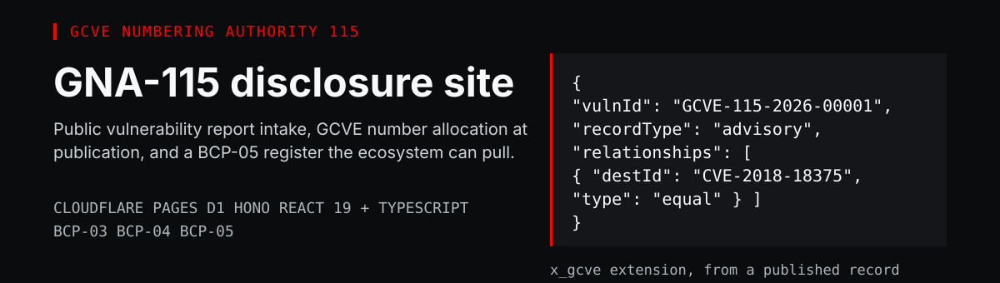
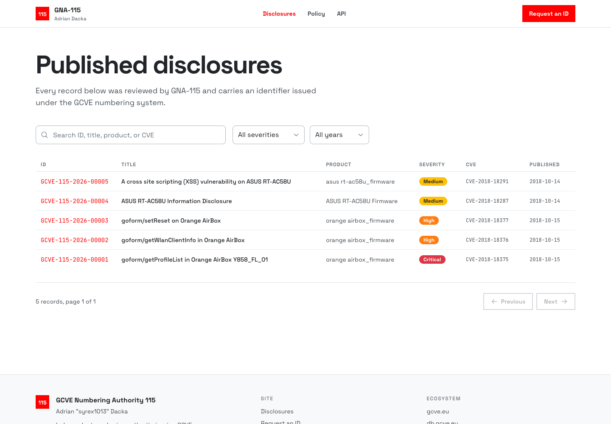
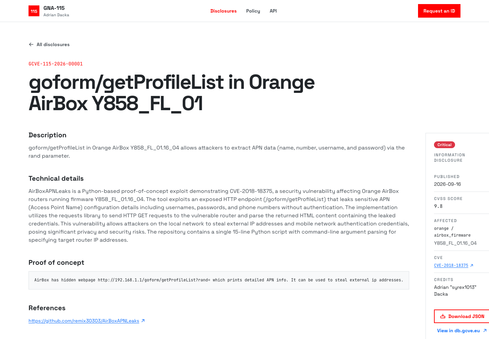
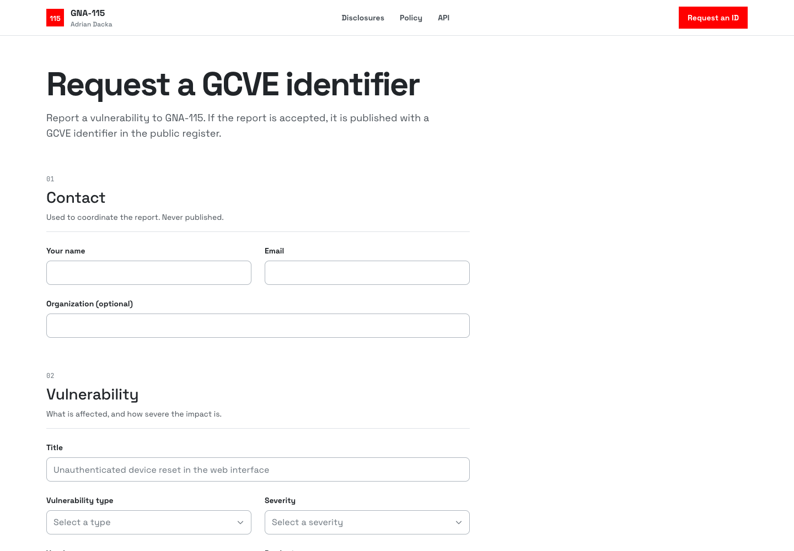
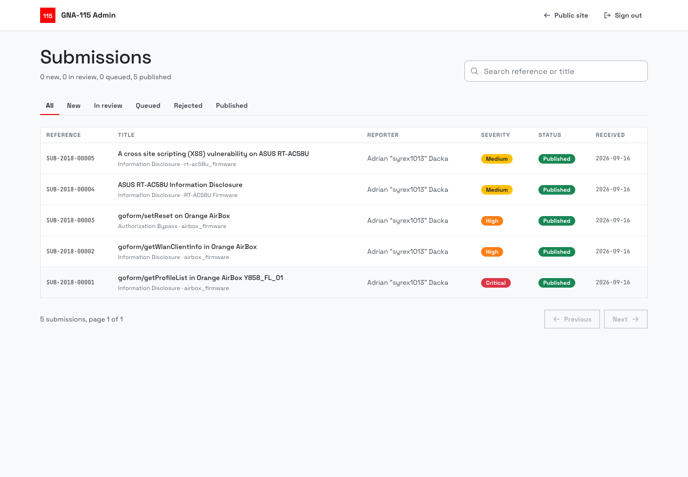
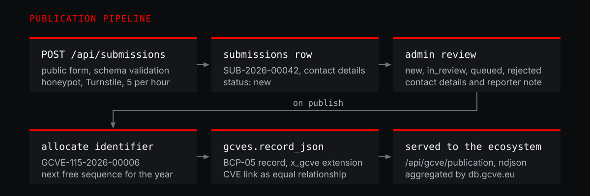

<p align="center">
  
</p>

A GCVE numbering authority in one deployable site: a public vulnerability report form, an admin workflow that allocates a `GCVE-115-YYYY-NNNNN` identifier the moment a report is published, and a register served in the GCVE BCP-05 format to aggregators such as [db.gcve.eu](https://db.gcve.eu).

GNA-115 is the numbering authority Adrian "syrex1013" Dacka operates inside the [GCVE](https://gcve.eu) project. This repository is the software behind it, live at **https://gna115.pages.dev**.

## The register

Published records are searchable by identifier, title, product, or CVE, and filterable by severity and disclosure year.



Every record opens into a full advisory with technical details, proof of concept, references, CVSS score and vector, weaknesses, and credit to the finder.



## Report intake

Researchers submit a report without an account: contact details, affected product and versions, severity, optional CVSS vector and CWE identifiers, description, technical details, proof of concept, and references. Submissions are validated, rate limited, and (when configured) bot checked before they are stored.



## Review and publish

The admin panel lists every report with its status, contact details, and the exact record that will be published. Status moves through `new`, `in_review`, `queued`, and `rejected`; publishing is the only path that allocates an identifier.



## How it works



1. **Intake.** `POST /api/submissions` validates the payload against a shared schema, drops honeypot submissions, verifies Turnstile when keys are configured, and enforces five reports per hour per address.
2. **Storage.** The report is stored with a per-year reference such as `SUB-2026-00042`. Submitter addresses are kept only as SHA-256 hashes.
3. **Review.** The admin panel moves the report through its states and keeps the coordination notes alongside it.
4. **Publish.** `POST /api/admin/submissions/{id}/publish` takes the next free sequence for the current year, builds the BCP-05 record, and writes the identifier, the record, and the status change in one atomic batch.
5. **Serve.** The record is immediately available to the ecosystem, and every record in the register is validated against the official `bcp-05` schema in the test suite.

## GCVE compatibility

The site implements the three practices that matter to consumers of a decoupled authority:

| Practice | Implementation |
| --- | --- |
| **BCP-03** decentralized publication | `GET /api/gcve/publication` and the static `/dumps/gna-115.ndjson`, both declared to the ecosystem through `security.txt` |
| **BCP-04** identifier format | `GCVE-115-<year>-<sequence>`, matching `^GCVE-[0-9]+-[\x22-\x7E]+$` |
| **BCP-05** record format | CVE Record Format 5.1 with the `x_gcve` extension, including `equal` relationships to known CVE identifiers |

### Endpoints

| Endpoint | Description |
| --- | --- |
| `GET /api/gcve/publication` | Pull endpoint returning full records. `per_page` (max 100), `page`, `date_sort`, `sort_order`, `since`, `cwe`, `product`, `source` |
| `GET /dumps/gna-115.ndjson` | Static dump, one JSON record per line |
| `GET /api/gcves` | Search the register (`q`, `severity`, `year`, `type`, `page`, `per_page`) |
| `GET /api/gcves/{id}` | Single record by GCVE identifier or cross referenced CVE identifier |
| `GET /api/gcve/api`, `/dump`, `/allocation`, `/pull-api` | The paths declared in the GCVE directory, kept in their original shapes for existing integrations |
| `POST /api/submissions` | Report intake |
| `POST /api/admin/login`, `/logout` | Admin session |
| `GET /api/admin/session`, `/stats`, `/submissions`, `/submissions/{id}` | Review data |
| `PATCH /api/admin/submissions/{id}` | Set `new`, `in_review`, `queued`, or `rejected` |
| `POST /api/admin/submissions/{id}/publish` | Allocate the next identifier and publish |

Sample record:

```json
{
  "dataType": "CVE_RECORD",
  "dataVersion": "5.1",
  "containers": {
    "cna": {
      "title": "goform/getProfileList in Orange AirBox Y858_FL_01",
      "affected": [{ "vendor": "orange", "product": "airbox_firmware", "versions": [{ "version": "Y858_FL_01.16_04", "status": "affected" }] }],
      "x_gcve": [{ "vulnId": "GCVE-115-2026-00001", "recordType": "advisory", "relationships": [{ "destId": "CVE-2018-18375", "type": "equal" }] }]
    }
  },
  "cveMetadata": { "vulnId": "GCVE-115-2026-00001", "state": "PUBLISHED", "datePublished": "2026-09-16T00:00:00.000Z" }
}
```

## Quick start

```sh
npm install
cp .dev.vars.example .dev.vars                 # optional: admin password hash and Turnstile keys
node scripts/hash-password.mjs "your-password" # paste the result into ADMIN_PASSWORD_HASH
npm run db:migrate:local
npm run db:seed-legacy:local                   # imports the five migrated advisories
npm run dev                                    # vite on 5173, Pages Functions on http://localhost:8788
```

`npm run preview` builds the production bundle and serves it with the Functions from `dist`, which is the closest local equivalent of production. Turnstile is skipped while `TURNSTILE_SECRET_KEY` is empty, so no keys are needed to run locally.

| Script | Purpose |
| --- | --- |
| `npm run dev` | Vite plus `wrangler pages dev` proxy |
| `npm run preview` | Production build served on port 8788 |
| `npm run build` | Build the SPA into `dist` |
| `npm run typecheck` | Type check the app and the Functions |
| `npm test` | Identifier, record building, legacy mapping, and validation tests |
| `npm run db:migrate:local` / `:remote` | Apply D1 migrations |
| `npm run db:seed-legacy:local` / `:remote` | Import the migrated advisories |
| `npm run deploy` | Build and deploy to the `gna115` Pages project |

## Stack

React 19 and TypeScript on Vite, Tailwind CSS v4 with Radix primitives, [motion](https://motion.dev) for the reveal animations, Hono for the API on Cloudflare Pages Functions, D1 for storage, and Turnstile for bot verification. A single admin password guards the review panel; sessions are server side and stored as hashes.

## Security

- Admin authentication uses PBKDF2-SHA256 with 100000 iterations and a constant time comparison. Session tokens are random, stored as SHA-256 hashes, and expire after seven days.
- Admin mutations require an `Origin` header that matches the host, on top of the `SameSite=Lax` HttpOnly cookie.
- Report intake allows five submissions per hour per address, and sign in allows ten attempts per hour.
- Submitter addresses are stored only as one way hashes, and reporter contact details are never published.
- `public/_headers` sets a strict content security policy, frame denial, and a permissions policy.

## Deploying

1. `npx wrangler d1 create gna115`, then put the printed `database_id` into `wrangler.toml`.
2. `npm run db:migrate:remote && npm run db:seed-legacy:remote`.
3. Create a Turnstile widget for the production domain and set `TURNSTILE_SITE_KEY` and `TURNSTILE_SECRET_KEY` as Pages environment variables. This is required in production.
4. `node scripts/hash-password.mjs "<admin password>"` and set `ADMIN_PASSWORD_HASH` as a Pages environment variable.
5. `npx wrangler pages project create gna115 --production-branch main`, then `npm run deploy`.

Once the new domain answers, ask the GCVE project to repoint the GNA-115 directory entry (`gcve_url`, `gcve_api`, `gcve_dump`, `gcve_allocation`, and `gcve_pull_api`). The deployment keeps the previous endpoint paths working, so existing integrations do not break before or after that change.

## Migrated records

`scripts/seed-legacy.ts` imports the five advisories published by the previous site as `GCVE-115-2026-00001` through `GCVE-115-2026-00005`. Each keeps its original CVE as an `equal` relationship, keeps the original public disclosure date, and is reproducible from the snapshot in `scripts/legacy-dump.json`.

## Scope and limits

- Single administrator. The session table supports more, but there is no user management.
- No email is sent from the site. Coordination happens from the admin panel, which shows reporter contact details.
- Published records are immutable in substance; corrections are published as new records that reference the original advisory.
- Turnstile is optional in development and required in production; a deployment without keys will accept submissions unverified.
- No license is declared for this repository yet.
